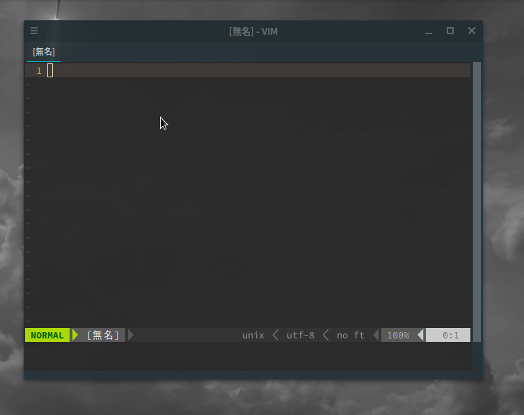

# popruby

## What's this?
A GUI Application, which executes Ruby code from TextView and copy the result of execution into Clipboard.  
Please watch an example usage:  

## How to Install

- 1) Build your self by following steps:
  - 1-1) `$ git clone https://github.com/alphaKAI/popruby`
  - 1-2) `$ cd popruby`
  - 1-3) `$ dub build --build=release`
- 2) Register custom shortcut with Desktop Environment.
- 3) Enjoy!

## Requirements

- DMD(>= v2.092.1) or LDC(>= 1.22.0)
- DUB(>= 1.21.0)
- Ruby(to execute ruby code)
- xsel(to copy into clipboard)

## License
popruby is released under the MIT License.  
Please see `LICENSE` file for details.  
Copyright (C) 2020 Akihiro Shoji.
